# Improve your Postman mock server experience with the Man-In-The-Middle pattern
## Introduction

Have you ever tried setting up a Postman mock server to help automate your API testing, only to find that URL parameters are completely ignored?  Or maybe the body of your POST call isn't matching up with the example you expect it to?

Yeah, me, too.

In this guide, we're going to walk through a simple solution that gives you complete control of how your mock responses are identified.

What you need to know
* Basic Node JS
* Basic HTTP

Code for this project will be written in Node.js

As I work through this guide, I am using Windows 10 and Chrome browser.  If you plan to code along, I recommend a GUI-based operating system.

If you already know what Postman and mock servers are, you can skip to the next section.

## About Postman and Mocks
From https://postman.com/home:

> Postman is an API platform for building and using APIs. Postman simplifies each step of the API lifecycle and streamlines collaboration so you can create better APIs—faster.

One of the features of the platform is "mock servers".  As the name impllies, a mock server pretends to be something it's not.  Think of it as an API emulator.  It has a set of canned responses to your calls.  This is especially useful for testing scenarios - it gives a static environment that will always respond the same way for the same input.

Mostly.  The Postman mock server "matching algorithm" has a couple of weaknesses that can get in the way of detail testing; URL query strings are ignored, and request body matching often fails.

Keep reading to see one way to work around this issue!

## Overview of our solution
There is a common hacking technique we can make use of here, called "The Man in the Middle".

In case you’re not aware, the Man in the Middle pattern works by inserting an agent between two systems, giving access to the data sent back and forth between them.  Law enforcement agencies use this technique for “wire taps” on cell phones.  They set up a broadcast tower which pretends to be the cell tower for the target’s cell phone company.  It then monitors traffic to copy the traffic of their suspect.  All of the data being observed is still delivered to the intended destinations, and the end points are none the wiser. 

The Man in the Middle (MitM) pattern is just a tool, however – and we are going to use it for good instead of evil! 

More astute readers are probably ahead of the game at this point.  That’s right – we can use MitM to send a request to the mock server that duplicates the original request, but with a special header added that tells Postman which example response to send.

-----------------------------------------------------------

> **_A little more about postman:_**: One of the Postman features that is sibling to mock servers is "Collections".  A collection is a hierarchy of HTTP requests.  Once you have issued one of the requests, you can save the request + response pair as an "Example".  A Postman mock server is tied to a collection.  When a request comes in to the mock server, the mock server inspects the request against the examples in the collection.  If it finds an acceptable match, it will return the response in that match.

----------------------------------------------------------------

The Postman team has added some features to the matching algorithm which allow us to target specific examples using HTTP Headers, however using those headers in your code means the code being tested is not the same as the code to be released.  

Using the Man in the Middle pattern, we can add the desired header and our code is none-the-wiser for what is answering it's calls.

Here is a quick diagram of how we will use MitM to improve our tests: 

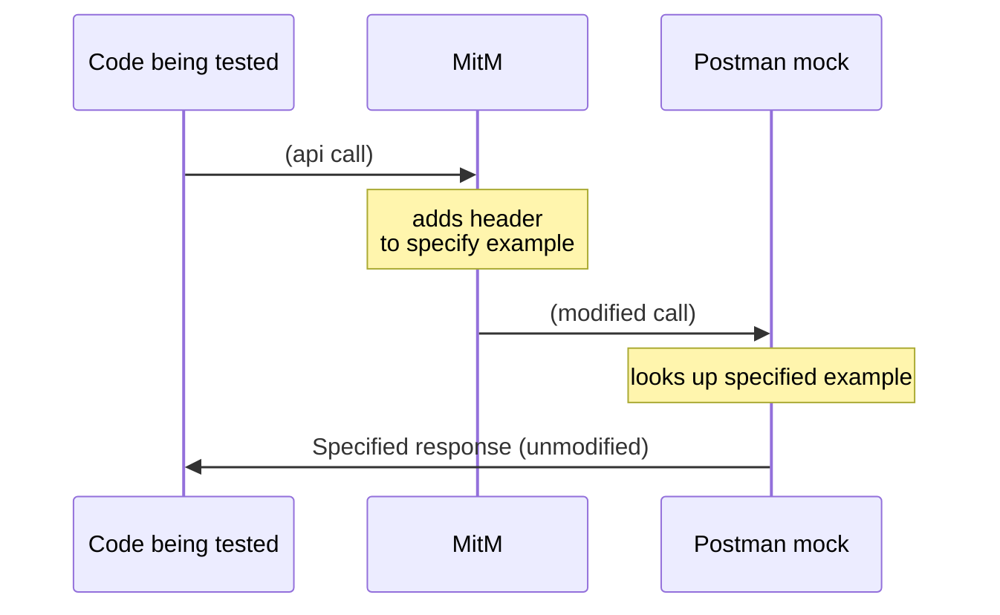

## Let's get to it! 
Here is what we're going to do in Postman:
1. Create a collection to mock in Postman
2. Create a mock server for that collection
3. Demonstrate calls from the browser to that mock server

On our development machine:
1. create a node web server project
2. Add the ```http-proxy``` library
3. Write the code to intercept the quest
4. test/debug the code from the browser

## Create the mock server in Postman
When we log into postman, we are presented with a menu that allows us to select or create a "Workspace".

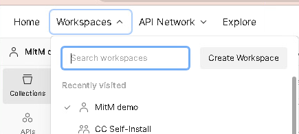

Click the "Create Workspace" button, fill in the workspace details and click "Create Workspace"

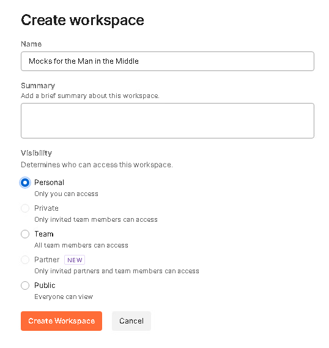

Now we will create the collection which will define our mock server responses.

Click the "+" button to the right of the Collections Icon to create a new collection.

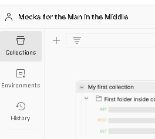

Give your collection a name, and then click the "Add a Request" link, or click the "..." icon that appears to the right of the collection name, and select "Add Request"

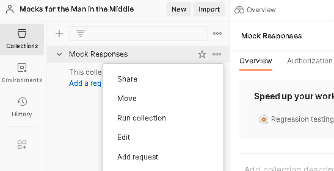

Name your request, set the URL to ```http://localhost/api```.  The click the "..." icon next to the request and select "Add Example"

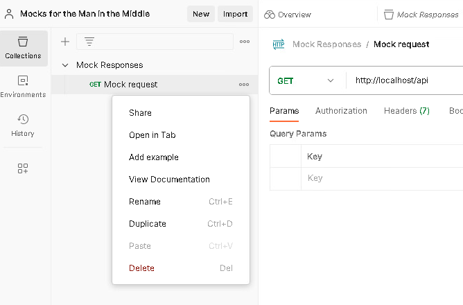

Name this example "No Query", then click it's "..." button and select "Duplicate".  Then duplicate it again.

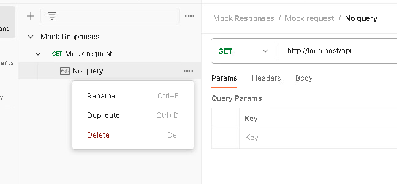

Rename the duplicates to "Foo=Bar" and "Bar=Baz", then add "?foo=bar" and "?bar=baz" to the urls (respectively)

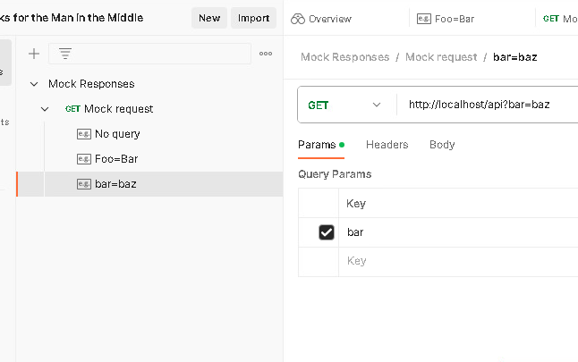

Edit the bodies of the examples.  Select "Body" (in the next image, it's underlined in orange), then select "raw" (the orange dot).

For the "Foo=Bar" example, put "Foo is barred" in the response body.

For the ```bar=baz``` example, use the content type drop-down (blue "JSON" in the image) and select JSON, then add the following as the body:

```json
{
    "foo": {
        "bar": "baz"
    }
}
```
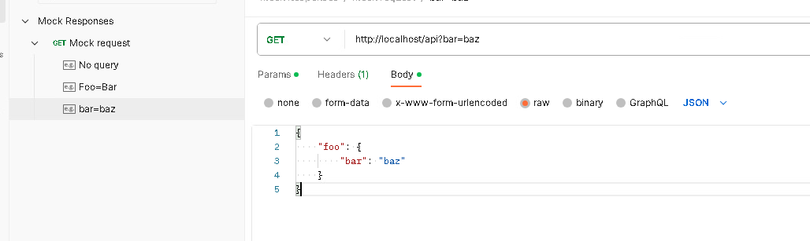

(It looks like a lot because I'm being detailed.  Believe me, once you've done it a time or two it gets really easy!)

We now have our collection ready to be mocked.

Click the "..." button for the collection and select "Mock collection"

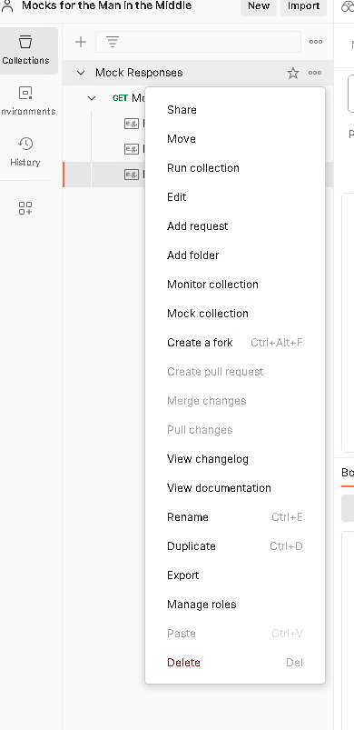

Name your mock server, make sure the collection is correct and click "Create Mock Server"

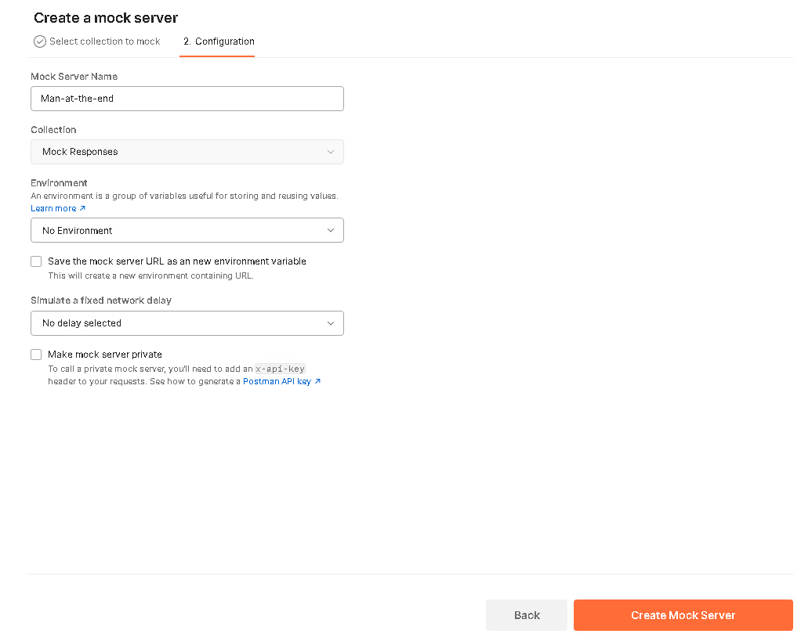

A new button for "Mocks" is added to the list of panels.  In the future, you can click that button to see a list of your mock servers for this workspace.

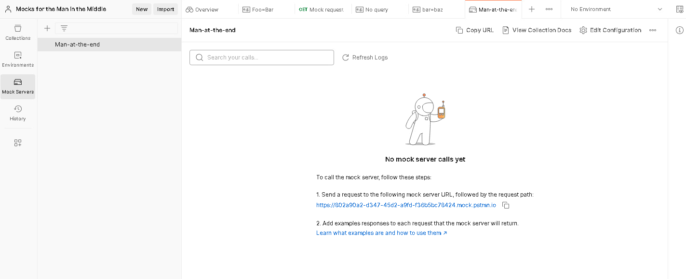


Copy the mock server path to your clipboard and open a new browser window (or tab - whatever is easier for you), paste it there and add "/api" to the URL.

Hit "enter" to browse to the mock server and you should see ... wait, what?  Nothing? That's not right.  Refresh the browser a couple of times.  Still nothing?  Hmmm ...

Is the mock server being hit?  On the "Mock server" page, click the  button.

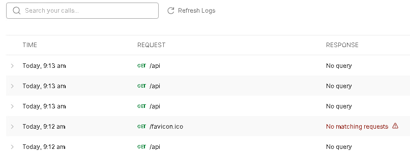

Ok, we can see that the "No Query" example is identified - just as we'd expect.  (Ignore favicon.ico - the browser will do that automatically).

So why don't we see anything in the response?

Checking the "Network" tab in browser developer tools (F12), we can see that nothing was delivered in the response (Content-Length is 0):

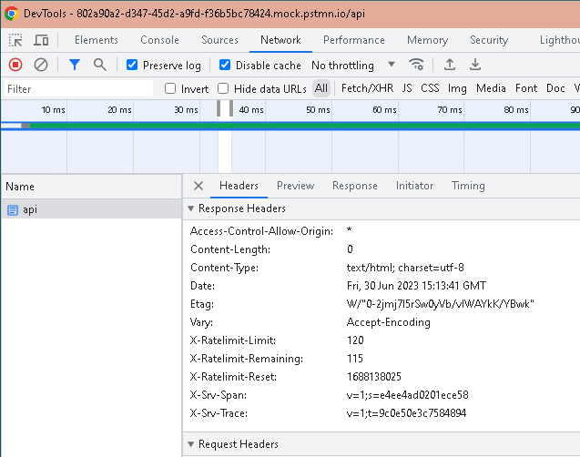

Must be something about the example.   Let's double-check it...

Oops!  I forgot to have you add content to the response body!

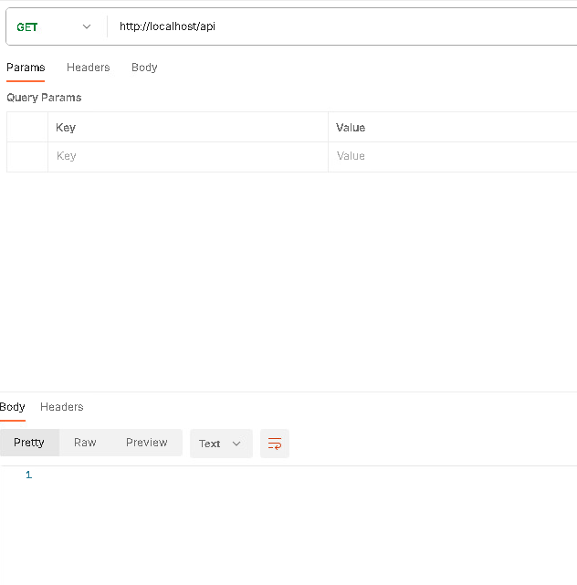

Fix that and try again.  That did it.

So, now we have a mock server we can call to test our "API" against.  And you have a little feel for how to debug when it doesn't work right.

Let's try one more thing, though - just to prove all this time is worth it.  In your browser, add "?Foo=Bar" to the end and hit enter.  You'd expect to see "Foo is barred".  Instead you see what you put in the response body for "No query"

Let's fix that.

## Time to write code!
 
I will be using the command-line and Visual Studio Code for this.

What we are going to do is create a small web server that will send a request to our Postman mock server for each request it recieves, and copy the response it recieves to return back to the caller.  Before sending the request to Postman, however, we're going to check for a query string that matches one of our examples.  If we find one, we'll add a header to the request which will tell Postman "Use this specific example".

The first thing we need is a workspace.  Create a folder to do your work in.  (I'm calling mine mitm-tutorial.)  Navigate to that folder in your command-line and run ```npm init``` to create the node.js project:

```
npm init -y
```

(The ```-y``` just means "accept all defaults")

Now, fire up your project editor!  (VSCode for me)

Open index.js load the "http" library

```Javascript
const http = require("http")
```

Now add the web server code by calling "createServer":
```javascript
const server = http.createServer(
	async (req, res) => {
		res.statusCode = 200
		res.end()
	}
)
```
The parmeter to createServer is a function that gets called whenever a request comes in.  That function recieves the incoming request object, and a response object which is what will be retured to the caller.


Now spin up the server by adding
```javascript
server.listen(5050)
```

to the end of the file.

Right now you have a fully functioning web server that does almost nothing.

Before we make it do something, let's add a little supporting code.  First, let's make a variable for our mockerver name so we can use it later.  While we're saving keystrokes, let's also alias ```console.log``` to ```log```.   Add this to the top of ```index.js``` but after defining the variable ```http```

```javascript
const mockServer = "{{insert mock server name here - take 'https://' off the beginning}}"
const log = console.log
```

Before we continue, we need two more variables - the IDs of the examples we want to use.  

Back in the Postman UI, select one of the examples.  At the right of the example, there is a small action bar.  Click the information icon on that bar

: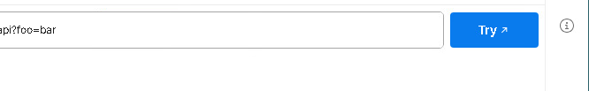

This displays a details panel, including the example ID - and even a handy "copy to the clipboard" icon!

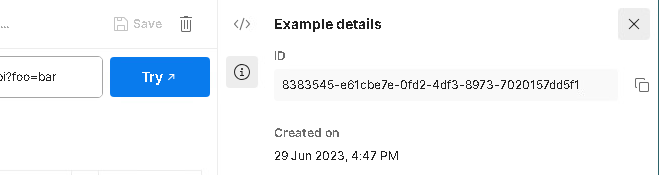

Copy the ID to the clipboard and create a variable in index.js for it.  Do the same for the other example.
```javascript
const fooBarId = "{{your Foo=Bar example id}}"
const barBazId = "{{your bar=baz example id}}"
```

Ok!  It's pretty much cake from here!  First scrub the body of the callback function inside of createServer:

```javascript
const server = http.createServer(async (req, res) => {

})
```
... we're gonna fill it in piece by piece.

The first piece we'll need is to create the mock server URL we're going to call.  ```req``` has a property ```url``` that isn't really a url - it's the part of the URL after the server and port.  For example, if we put "http://localhost:5050/api?Foo=Bar" in the browser, ```req.url``` will be ```/api?foo=bar```.  This makes life easy for us - we just need to put a couple of strings together.  

Do that inside of the createServer call (while we at it, make a variable for the url - we're going to need it later)
```javascript
const server = http.createServer(async (req, res) => {
	const path = req.url
	const remoteUrl = `https://${mockServer}${path}`

})
```

We want to copy all of the headers from the input to our call to Postman, but there is one that we have to modify - "host".  "Host" says what domain we're trying to access.  The request is accessing the "localhost" domain - but we want to access the postman mock server's domain.  So, let's copy the request headers and change the "host" in that copy:


```javascript
const server = http.createServer(async (req, res) => {
	const path = req.url
	const remoteUrl = `https://${mockServer}${req.url}`

	const headers =  {...req.headers, "host": mockServer}


})
```

Time to check if we need to add the "x-mock-response-id" header, which tells Postman "I want this specific example":

```javascript
const server = http.createServer(async (req, res) => {
	const path = req.url
	const remoteUrl = `https://${mockServer}${req.url}`

	const headers =  {...req.headers, "host": mockServer}

	if (path == "/api?Foo=Bar") {
		headers = {...headers, "x-mock-response-id": fooBarId}
	}
	else if (query == "bar=baz") {
		headers = {...headers, "x-mock-response-id": barBazId}
	}

})

```

Making the call to postman is a pretty standard ```fetch()``` call:

```javascript
const server = http.createServer(async (req, res) => {
	const path = req.url
	const remoteUrl = `https://${mockServer}${req.url}`

	const headers =  {...req.headers, "host": mockServer}

	if (path == "/api?Foo=Bar") {
		headers = {...headers, "x-mock-response-id": fooBarId}
	}
	else if (query == "bar=baz") {
		headers = {...headers, "x-mock-response-id": barBazId}
	}

	const proxied = await fetch(remoteUrl, {
		...req,
		headers: headers
	})

})

```

Now copy the Postman response to our response.  We're not going to copy absolutely everything - just the headers, status code, status message and body:

```javascript
const server = http.createServer(async (req, res) => {
	const path = req.url
	const remoteUrl = `https://${mockServer}${req.url}`

	const headers =  {...req.headers, "host": mockServer}

	if (path == "/api?Foo=Bar") {
		headers = {...headers, "x-mock-response-id": fooBarId}
	}
	else if (query == "bar=baz") {
		headers = {...headers, "x-mock-response-id": barBazId}
	}

	const proxied = await fetch(remoteUrl, {
		...req,
		headers: headers
	})

	res.setHeaders(proxied.headers)
	res.statusCode = proxied.status
	res.statusMessage = proxied.statusText
	for await (const chunk of proxied.body) {
		res.write(chunk)
	}	
	res.end()
})

```

I included ```res.end()```, which sends the response back to the browser.

Just one thing left to do.  We should add a little bit of logging so we know that things are happening.  Here is the entire server for you:

```javascript
const http = require("http")

const mockServer = "{{insert mock server name here - take 'https://' off the beginning}}"
const fooBarId = "{{your Foo=Bar example id}}"
const barBazId = "{{your bar=baz example id}}"

const log = console.log

const server = http.createServer(async (req, res) => {
	log(`handing request ${req.url}`)
	// define the postman mock url path by copying the path and query string 
	//	from the request.  Lucky for us, the "url" part of the incoming request is just that!
	const path = req.url
	const remoteUrl = `https://${mockServer}${path}`		

	// copy all of the headers from the request so that they are sent on to the postman mock server
	//	except replace the "host" header because we're not going to localhost like the request does
	const headers =  {...req.headers, "host": mockServer}

	// and then do a simple comparison
	if (path == "/api?Foo=Bar") {
		headers = {...headers, "x-mock-response-id": fooBarId}
	}
	else if (query == "bar=baz") {
		headers = {...headers, "x-mock-response-id": barBazId}
	}

	// now call Postman
	const proxied = await fetch(remoteUrl, {
		...req,
		headers: headers
	})

	// ... and copy the response from postman to our response
	res.setHeaders(proxied.headers)
	res.statusCode = proxied.status
	res.statusMessage = proxied.statusText
	for await (const chunk of proxied.body) {
		res.write(chunk)
	}	
	res.end()

	/// ... and we're all done!!!
	log(`all done (${proxied.status}: ${proxied.statusText})`)
});

log("listening on port 5050")
server.listen(5050);
```

Doesn't look like much, does it?  Fire it up and let's watch it work!

Once you see "listening on port 5050", go to your browser.  Browse to http://localhost:5050/api, then http://localhost:5050/api?Foo=Bar and http://localhost:5050/api?bar=baz.

Congratulations - you can now create all of the mock APIs you want in Postman, and you can work around any challenges the matching algorithm throws in your way!

## Wrapping up
The Postman platform is really amazing.  It gives us a great place to work out what our APIs look like, to document them and to test them as we write them.  The mock server feature gives us the ability to test code that's consuming an API even when the API hasn't been written yet.

Unfortunately, there are aspects of REST APIs that the mock server doesn't support.  With what we've done today, that won't stop us!

We have our web server that we can call, which will make sure the right mock responses are delivered.  And our code doesn't need to know it's calling a mock server. 

Not only that, but we can pump up our man in the middle for other uses, too.  Maybe tracking test cycles?  Maybe storing variables to use in future requests?  Anything we can't do easily in the Postman mock server, we can no do fairly easily in our mock server proxy.

This is a very high-level summary to show how the proxy can determine the response.  I'm sure I've left a bunch of bugs in the code (I really don't recommend using it as-is :).

### Thank you to the tools and services I used in writing this up - all of them are free!

#### Postman 
[Postman Home Page](https://www.postman.com/)
[Postman Mock server matching algorithm](https://learning.postman.com/docs/designing-and-developing-your-api/mocking-data/matching-algorithm/)

#### Visual Studio Code
https://code.visualstudio.com/

#### StackOverflow
https://stackoverflow.com

#### Mermaid (for  drawing diagrams in the readme)
An diagramming extension for the markdown language
* [github docs](https://docs.github.com/en/get-started/writing-on-github/working-with-advanced-formatting/creating-diagrams) 
* [Mermaid docs](https://mermaid.js.org/intro/)
* [Mermaid Live Editor](https://mermaid.live/edit#pako:eNptj7sOwjAMRX_FeKX9gQ5FSAzAyprFSm9ppTwgJEJV1X8naWHD05V9jqU7s_YduOEXnglO4zTKPYhVjvIczahRt-3-6gfX0BnGeCq5osG_SQJo8unwF94wLa4gNEACWXzRcqszWq9OfjxudkWX1VjprO3-4xfqAUP3AIk7rtgiWBm73GIuguI4wEJxk2OHXpKJipVbMiop-tvkNDcxJFScHp3EX-ltuXwAZiVYtA)
* [Visual Studio Code Plugin](https://github.com/mjbvz/vscode-markdown-mermaid)


### A parting gift
Here are a couple of links to make life easier for you:

The Postman Collection I used to make sure the code I was writing works: https://sorenson.postman.co/workspace/Mocks-for-the-Man-in-the-Middle~1f4bf799-428e-4abc-b8ff-f0c811f049d6/overview

A github repo that contains this entire project: https://github.com/ebrown5-captioncall/mitm-tutorial


